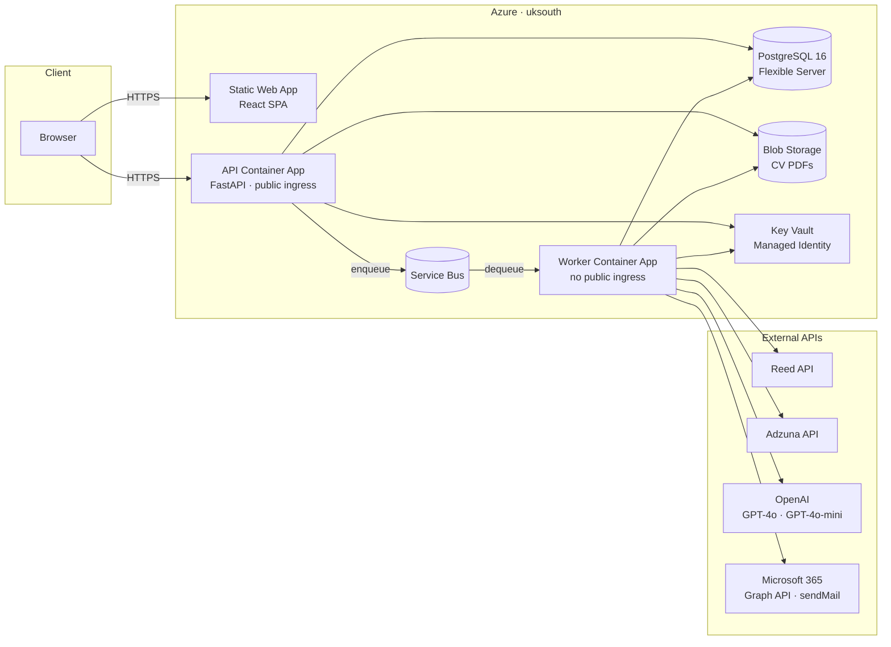

# AI Job Matcher & CV Analyzer

A UK-focused web application that scores job listings against your CV using GPT-4o, giving you a ranked shortlist with interview-likelihood assessments and skill gap breakdowns — without manual searching.

[](https://github.com/DNBLabs/ai-job-matcher-and-cv-analyzer/actions/workflows/ci.yml)
[](https://github.com/DNBLabs/ai-job-matcher-and-cv-analyzer/actions/workflows/deploy.yml)

---

## Features

- **CV upload & AI title suggestions** — upload a PDF CV and receive GPT-4o-mini job title recommendations instantly
- **Dual scoring** — each listing receives a Match Score (0–100) and an Interview Likelihood rating (High / Medium / Low)
- **Multi-source job aggregation** — fetches from the Reed API and Adzuna REST API concurrently
- **Skill breakdown** — matched skills, skill gaps, red flags, and talking points per listing
- **Divergence badges** — surfaced when scores and likelihood conflict (e.g., "Skills fit, seniority gap")
- **Run history & email notifications** — asynchronous runs with live dashboard polling and email on completion
- **Fair-use quota** — 3 runs per rolling 24 h, 1 concurrent run; admin bypass for unlimited users
- **Scale-to-zero hosting** — Azure Container Apps idle to zero; cold-start banner prevents confusing UX

---

## Architecture



All infrastructure port boundaries are behind interfaces (`BlobStore`, `JobQueue`, `SecretProvider`, `NotificationPort`, `LlmClient`), so local dev swaps to Docker Compose emulators with zero code changes.

See [docs/adr/FINAL_ARCHITECTURE.md](docs/adr/FINAL_ARCHITECTURE.md) and the [ADR index](docs/adr/) for decision records.

---

## Tech Stack

| Layer | Technology |
|---|---|
| Backend | Python 3.12, FastAPI, SQLAlchemy 2.0, Alembic |
| Frontend | React 19, TypeScript, Vite + Rolldown, React Router v7 |
| Database | PostgreSQL 16 |
| Queue (local) | RabbitMQ 3.13 |
| Queue (prod) | Azure Service Bus (Basic) |
| Blob (local) | Azurite |
| Blob (prod) | Azure Blob Storage |
| Secrets (prod) | Azure Key Vault |
| LLM | OpenAI GPT-4o (scoring), GPT-4o-mini (title suggestions) |
| Email (prod) | Microsoft 365 Graph API `sendMail` via Managed Identity |
| Infra (IaC) | Terraform 1.14+, `azurerm ~> 4.0` |
| CI/CD | GitHub Actions with OIDC (no stored Azure credentials) |
| Container hosting | Azure Container Apps (scale-to-zero) |
| Frontend hosting | Azure Static Web App (Free SKU) |
| Testing | pytest, Vitest + React Testing Library |

---

## Getting Started (Local)

### Prerequisites

- Python 3.12
- Node.js 22+
- Docker and Docker Compose

### 1. Clone and configure

```bash
git clone https://github.com/DNBLabs/ai-job-matcher-and-cv-analyzer.git
cd ai-job-matcher-and-cv-analyzer
cp .env.example .env
```

Open `.env` and fill in the required values (see [Environment Variables](#environment-variables)).

### 2. Start local infrastructure

```bash
docker compose up -d
```

This starts PostgreSQL 16, Azurite (blob emulator), and RabbitMQ.

### 3. Backend

```bash
cd backend
pip install -e ".[dev]"
alembic upgrade head

# Seed your account as admin (first-time only)
ADMIN_EMAIL=you@example.com python -m scripts.seed_admin

# Start the API
uvicorn app.main:app --reload
# → http://localhost:8000
```

### 4. Worker (separate terminal)

```bash
cd backend
python -m worker.main
```

### 5. Frontend (separate terminal)

```bash
cd frontend
npm ci
npm run dev
# → http://localhost:5173
```

### 6. Verify

```bash
curl http://localhost:8000/health
```

---

## Environment Variables

Copy `.env.example` to `.env`. Variables marked **required** must be set before the API will start.

| Variable | Required | Description |
|---|---|---|
| `DATABASE_URL` | Yes | PostgreSQL connection string |
| `SESSION_SECRET` | Yes | 32-byte hex secret — `openssl rand -hex 32` |
| `GOOGLE_OAUTH_CLIENT_ID` | Yes | Google OAuth 2.0 client ID |
| `GOOGLE_OAUTH_CLIENT_SECRET` | Yes | Google OAuth 2.0 client secret |
| `OPENAI_API_KEY` | Yes | OpenAI API key |
| `ADZUNA_APP_ID` | Yes | Adzuna API app ID |
| `ADZUNA_APP_KEY` | Yes | Adzuna API key |
| `REED_API_KEY` | Yes | Reed API key |
| `ALLOWED_ORIGINS` | Yes | Comma-separated CORS origins (e.g. `http://localhost:5173`) |
| `BLOB_STORE_BACKEND` | No | `memory` (default), `azurite`, or `azure` |
| `JOB_QUEUE_BACKEND` | No | `in_process` (default), `rabbitmq`, or `servicebus` |
| `SECRET_PROVIDER_BACKEND` | No | `env` (default) or `keyvault` |
| `NOTIFICATION_BACKEND` | No | `log` (default, prints to console) or `graph` (M365 email) |
| `FRONTEND_BASE_URL` | No | Base URL for magic-link emails (e.g. `http://localhost:5173`) |

See `.env.example` for the full list including adapter-specific variables.

---

## Running Tests

**Backend:**

```bash
cd backend
pytest -v
```

Tests run against a real PostgreSQL instance (started via `docker compose up -d`). No mocking of the database.

**Frontend:**

```bash
cd frontend
npm run test        # Vitest (watch mode)
npm run test -- --run  # single pass
npm run lint        # ESLint
npm run build       # type-check + production build
```

---

## Project Structure

```
.
├── backend/
│   ├── app/
│   │   ├── api/           # HTTP routes and middleware
│   │   ├── auth/          # Session, Google OAuth, magic links
│   │   ├── db/            # ORM models, migrations, repositories
│   │   ├── domain/        # Business logic (quota, scoring, divergence)
│   │   ├── job_sources/   # Reed and Adzuna adapters
│   │   ├── ports/         # Infrastructure interfaces
│   │   ├── adapters/      # Port implementations (local + Azure)
│   │   └── services/      # Orchestration and pipeline services
│   ├── worker/            # Background job processor
│   ├── tests/             # pytest test suite
│   └── alembic/           # Database migrations
│
├── frontend/
│   └── src/
│       ├── api/           # Fetch-based API client
│       ├── auth/          # Auth context and protected routes
│       ├── components/    # Reusable UI components
│       ├── hooks/         # useRunPolling, useApiWarmup
│       └── pages/         # Route-level page components
│
├── infra/
│   ├── bootstrap/         # One-time: Terraform remote state + OIDC identity
│   ├── app/               # Application stack (ACA, DB, Key Vault, etc.)
│   └── grants/            # One-time: Graph Mail.Send permission grant
│
├── docs/
│   ├── adr/               # Architecture Decision Records
│   ├── security/          # THREAT_MODEL.md (STRIDE analysis)
│   ├── finance/           # BUDGET.md (£75/month cap, line-item breakdown)
│   └── ops/               # RUNBOOK.md (alerts, rollback, rotation)
│
└── .github/
    └── workflows/
        ├── ci.yml         # PR gate: test, lint, build, CVE scan
        └── deploy.yml     # main only: OIDC build, terraform apply, ACA pin
```

---

## Deployment

Production runs on Azure. Deployment is fully automated via GitHub Actions on every merge to `main`.

### One-time setup (per subscription)

```bash
# 1. Bootstrap — creates Terraform remote state storage and OIDC deploy identity
cd infra/bootstrap
export ARM_SUBSCRIPTION_ID="$(az account show --query id -o tsv)"
terraform init
terraform apply -var "owner_email=you@example.com"

# 2. Add GitHub repository secrets:
#    AZURE_CLIENT_ID, AZURE_TENANT_ID, AZURE_SUBSCRIPTION_ID  (from bootstrap output)
#    TFSTATE_STORAGE_ACCOUNT                                   (from bootstrap output)
#    GOOGLE_OAUTH_CLIENT_SECRET, OPENAI_API_KEY, ADZUNA_APP_ID,
#    ADZUNA_APP_KEY, REED_API_KEY                              (real credentials)

# 3. Apply the application stack
cd infra/app
terraform init -backend-config="storage_account_name=<from-bootstrap>"
terraform apply \
  -var "owner_email=you@example.com" \
  -var 'operator_ip_rules=["<your-ip>/32"]'

# 4. One-time Graph Mail.Send permission grant
cd infra/grants
terraform apply
```

See [infra/README.md](infra/README.md) for the complete setup guide and [docs/ops/RUNBOOK.md](docs/ops/RUNBOOK.md) for Day 2 operations.

### Continuous deployment

Every CI-green merge to `main` triggers the deploy workflow:

1. Authenticates to Azure via OIDC (no stored credentials)
2. Builds a SHA-tagged backend image and pushes to Azure Container Registry
3. Runs `terraform apply` on the application stack
4. Syncs secrets from GitHub to Key Vault
5. Pins both Container App revisions to the image SHA
6. Smoke-tests `/health`

**Rollback:** trigger the deploy workflow manually with a prior image SHA.

---

## Cost

Monthly spend target: **£75 hard cap**, alert at £60.

| Resource | Est. cost/month |
|---|---|
| PostgreSQL Flexible Server B1ms | £12–14 |
| Azure Service Bus (Basic) | £8 |
| Azure Container Apps (scale-to-zero) | £2–8 |
| Azure Blob Storage | £1 |
| Azure Key Vault | £1–2 |
| Azure Container Registry (Basic) | £4–5 |
| OpenAI GPT-4o-mini (titles) | £1–2 |
| OpenAI GPT-4o (scoring) | £12–28 |
| **Total (mid-range)** | **~£68** |

See [docs/finance/BUDGET.md](docs/finance/BUDGET.md) for the full breakdown and scaling assumptions.

---

## Security

- **Auth:** Google OAuth with CSRF state validation; email magic links (≥256-bit, single-use, 15 min, hash-only storage); HttpOnly + Secure + SameSite cookies
- **Authorization:** all queries owner-scoped; IDOR returns 404 not 403; `is_admin` enforced server-side only
- **CV storage:** MIME + magic-byte validation, 5 MB limit, safe PDF parse; encrypted at rest; worker reads via Managed Identity (no shared keys)
- **Secrets:** Azure Key Vault in production; no secrets in git, container images, or Terraform state
- **Network:** PostgreSQL and Blob Storage on private/service endpoints; worker ACA has no public ingress
- **Rate limiting:** 3 magic-link requests/email/hour; ~100 API req/min/IP; 3 runs/24 h quota
- **Deployment:** OIDC only; federated credential restricted to repo + `main` branch; non-root containers (UID 10001)
- **Privacy:** OpenAI zero-retention API; CV content and prompts never logged

See [docs/security/THREAT_MODEL.md](docs/security/THREAT_MODEL.md) for the full STRIDE analysis.

---

## Contributing

1. Fork the repository and create a feature branch from `main`
2. Run the full CI suite locally before pushing (`pytest -v` + `npm run test -- --run` + `npm run lint`)
3. Open a pull request — CI must pass before review
4. Do not use `Closes #N` or `Fixes #N` in PR descriptions; use `Related to #N` instead

---

## License

This project is private. All rights reserved.
