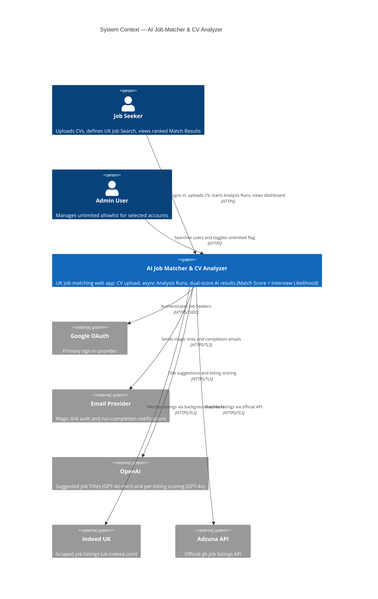
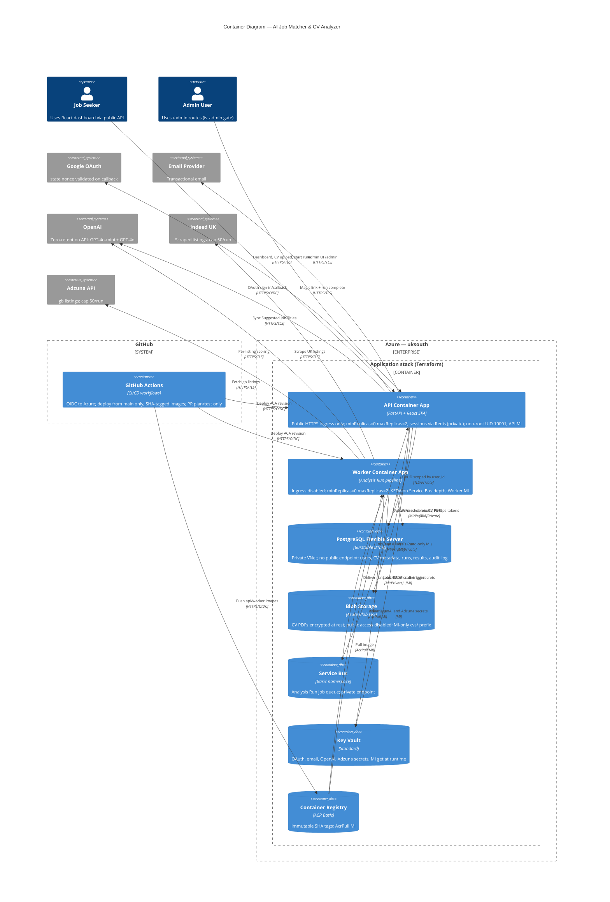

# Architecture Diagrams (C4)

**Source:** CONTEXT.md (Product, Scope, Security, Financial guardrails)  
**Last generated:** 2026-06-05

---

## Level 1 — System Context

Who uses the system and which external systems it depends on.

---

## Level 2 — Container Diagram

High-level technical building blocks, trust boundaries, and encrypted paths.

